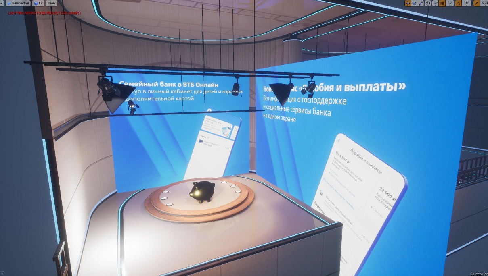

#  Hackathon VTB METAVERSE

### Описание

В репозитории содержатся элементы виртуального пространства (метаверса) и реализация сценариев взаимодействия пользователей с общим семейным счётом, как цифровым продуктом банка. Метаверс позволяет уменьшить generation gap, таким образом, предложение “Семейный счёт” и режим мультиплеера позволяет детям наблюдать за реальными финансовыми операциями, совершаемыми их родителями, и учиться на их опыте. Также представители разных поколений смогут в более вовлекающем, игровом формате проходить созданные ВТБ курсы по финансовой грамотности и инвестированию. А мультибонусы могут стать цифровой валютой, которая приятно разнообразит использование услуг банка.

[Видеодемонстрация](https://disk.yandex.ru/i/YKX2I7usrsJWUw)

### Технические требования
- `Unreal Engine 4.26 и выше`
- `Видеокарта с поддержкой DirectX 11`

### Функциональность

- Пользователь может передвигаться в виртуальном пространстве
- Пользователь может взаимодействовать с терминалами и визуализацией семейного счета - копилки
- При совершении покупок пользователь накапливает виртуальные баллы
- Виртуальные баллы возможно обменять на новые 3д-модели копилки, которые добавляют бонусы к кэшбеку и увеличивают процент кэшбека.

### Запуск проекта

- Для запуска проекта необходимо перейти в главное меню UE4, вызвать `File > Open Project` или в русскоязычной версии `Файл > Открыть Проект`, после чего в директории с проектом выбрать `Hakaton.uproject`

